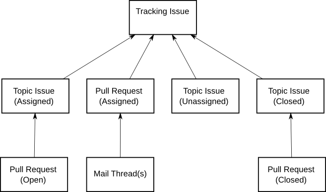
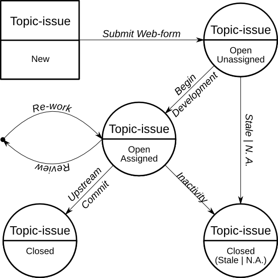

Workflow Details
----------------

+ Tracking issues do not take the place of high-level mailing-list
  discussoins and/or the :doc:`RFC process <../developer/IdeaLifeCycle>`.
  They are *only* intended to help coordinate simultanious development on a
  specific topic.
+ Tracking issues provide an automatically updated centralized
  location tracking a collection of related topic issues and pull
  requests.
+ Anybody with access to open normal github issues and pull requests
  is able to link them to one or more tracking issues.
+ No discussion should be posted to tracking issues directly.  All discussion
  should happen within the topic-issues and pull requests.

Topic Issues
------------

+ For each proposed feature or enhancement, an issue is opened (Topic Issue)
+ Topic issues summarize the proposed test/enhancement and provide a place
  for discussion.
+ Topic issues are labelled with "*future*" and topic-specific label(s)
  such as "*virt-libvirt*", "*client*", *etc.*
+ The topic issue is then linked to the tracking issue by mentioning it's number.
  For example: "**Linking to tracking issue #9959**"
+ Code cannot be posted to a topic issue directly.  (see `Pull Requests`_ and
  `Mail List Publishing`_ below)

Topic Issue States
------------------

+ **Open and unassigned**: Anybody may take ownership and begin working on
  this topic, and/or contribute to the discussion.
+ **Open and assigned**: Someone is actively working on code for this topic.
  To avoid conflicts, other contributors will need to coordinate with the
  assigned person/team.
+ **closed**: Code is finished and has been committed to the project.  The
  issue may be re-opened under some circumstances.  For example, if
  a major bug is discovered, and the code is removed from upstream.
+ **closed stale**: Open or Open/Assigned issues with no code posted
  within several months.

Pull Requests
-------------

+ `Pull requests are a github-based tool`__ where a developer makes a request
  that one of their topic-branches be merged with the upstream branch.  Pull
  Requests may not be opened unless there are code changes available to push.
+ All Pull Requests are also github issues. Comments can be posted, including
  comments in-line with the code.
+ Sending the full patch-set to the Mailing list is not necessary.  However
  a note to the list containing a link and summary are appreciated.
+ Pull Requests are linked to tracking issues in exactly the same way as
  topic-issues. Simply mention it's number. For example:
  "**Linking to tracking issue #9959**"
+ If multiple pull requests are required for a single topic, then
  an intermediate topic issue should be opened and linked to the tracking-
  issue.  The pull requests may then all be linked to the intermediate
  topic issue.

.. _PULLREQ: https://help.github.com/articles/using-pull-requests
__ PULLREQ_

Pull Request Updates
--------------------
+ Updates made by the author to a topic-branch (then pushed up to github)
  will automatically update the Pull Request.
+ If other developers want to contribute to a pull request, the process
  is identical, except when submitting.  In this case, the target branch
  should be the original author's forked branch instead of upstream.
+ The original author may then review the changes, and if accepted
  they will automatically be merged in with the main pull request.
+ **Utilizing this method is critical, since it preserves the state
  of the issue and keeps the tracking issue from becoming cluttered.**

Mail List Publishing
--------------------
+ Utilizing *git send-email*, patches may be sent to the mailing list.
  However, revisions require re-sending the entire patch-set.  This
  works well for small, simple patches.
+ In order to track proposed and under-development mailing list
  patch work, please also open a github `Topic Issues`_.  The
  patches should be referenced in the topic issue by pasting a
  http-link from `the mailing list archive`__).
+ Mailing list patches for anything reasonably complicated
  must be split up logically and use of a cover-letter is
  highly encouraged (see :doc:`git setup/usage <../developer/GitWorkflow>`).
+ Discussion regarding mailings list patches should occur
  on the mailing list.  The github topic issue is simply
  used for tracking purposes.

.. _MLARCHIVE: https://www.redhat.com/archives/autotest-kernel/
__ MLARCHIVE_

