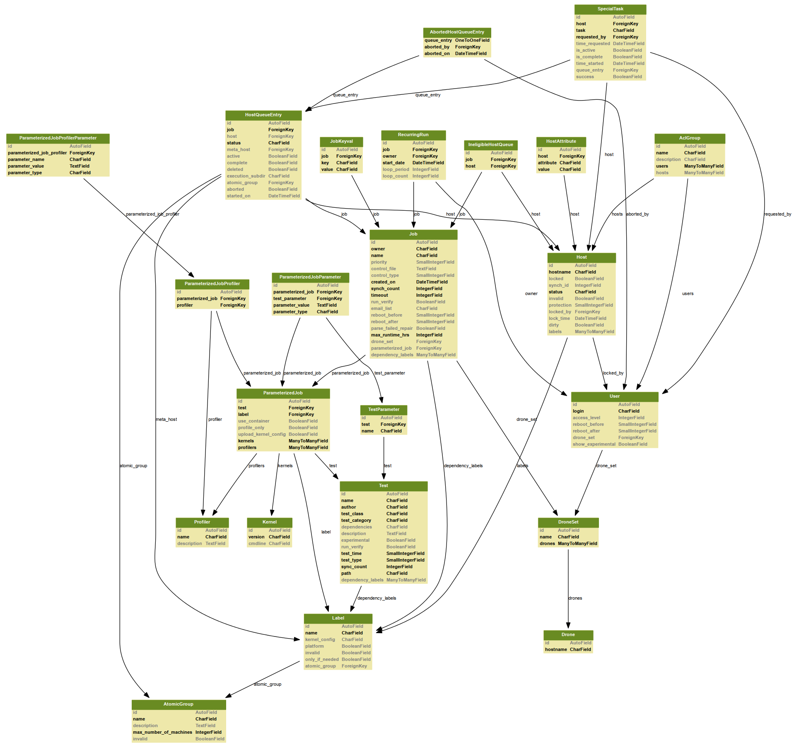

================================
Frontend Database (autotest_web)
================================

The AFE frontend and the scheduler both work from the "autotest_web"
database.

-  Test: a test than can be run as part of a job. Each row corresponds
   to a control file, most often found at (client|server)/tests/<test
   name>/control, but not always.
-  User: a user of the system.
-  Host: a machine on which tests can be run.
-  AclGroup: access control groups. Each group is in a many-to-many
   relationship with users and hosts and gives users in that group
   permission to run jobs on hosts in the same group.
-  Label: a label describing a type of host, such as "intel" or
   "regression_testing_machines". These help users schedule jobs on
   particular groups of machines.
-  Job: a logical job consists of a set of hosts and a control file to
   run on those hosts. It can be tracked throughout the system by its
   ID. A row in this table contains the control file for the job and
   information about how it should be run.
-  HostQueueEntry: this table provides a many-to-many relationship
   between jobs and hosts. It is used to keep track of the hosts on
   which a job is scheduled to run, and by the scheduler to keep track
   of the progress of those runs. It can also represent a "metahost" for
   a job, which indicates that a job is scheduled to run on any machine
   from a particular label.
-  IneligibleHostQueue: this table also provides a many-to-many
   relationship between jobs and hosts. It is used to indicate which
   hosts a job has already been scheduled against and is used by the
   scheduler in assigning metahosts.
