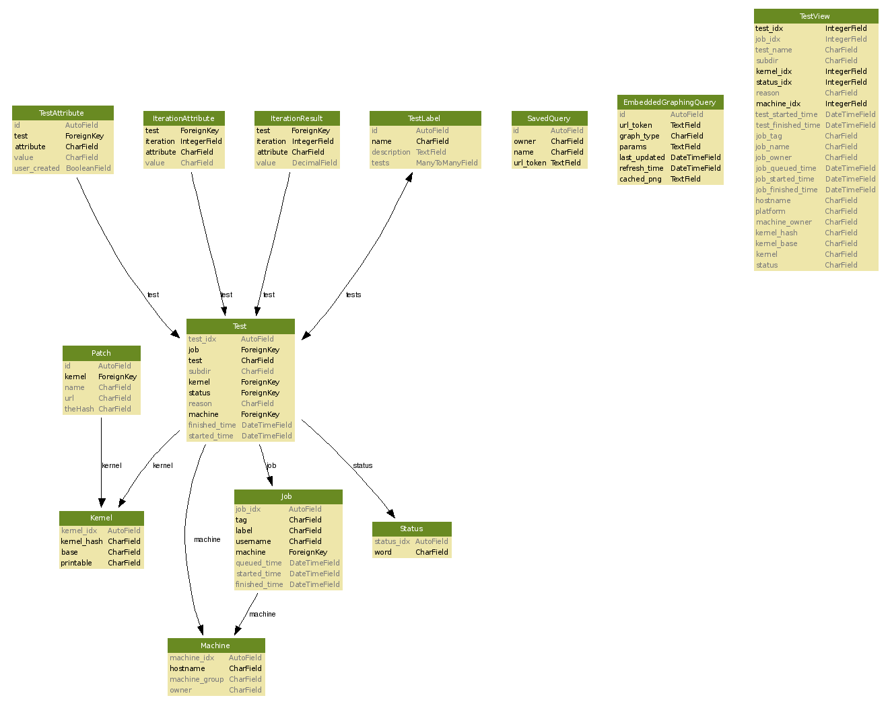

====================
TKO results database
====================

The TKO results database holds results of test runs. The parser puts
data into it and the TKO web interface allows users to view data from
it.

-  The ``tests`` table is the core of the DB and contains a row for each
   test run.
-  A job in the ``jobs`` table corresponds to a single execution
   instance of autoserv. Each job can have many tests.
-  The ``test_attributes``, ``iteration_attributes``, and
   ``iteration_result`` hold keyval information about tests.
-  The ``status`` table is simply an enumeration of tests status values,
   i.e. completed, failed, aborted, etc.
-  The ``kernels`` and ``patches`` tables hold kernel information for
   kernels against which tests are run.
-  The ``machines`` tables holds information on machines on which tests
   are run.

