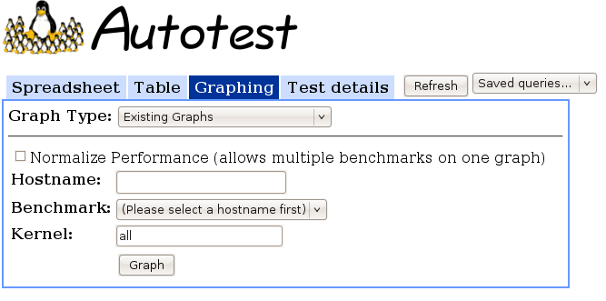

Existing Graphing Scripts Frontend
==================================

The **Existing graphing scripts frontend** is a graphical frontend to
some existing graphing CGI scripts in TKO.

Interface Options
-----------------

-  **Normalize Performance**: This checkbox allows you to normalize the
   performance numbers to percent differences instead of absolute
   numbers. Checking this option also allows you to select more than one
   benchmark at a time in the **Benchmark** control.
-  **Hostname**: Name of the machine you want to analyze. As you begin
   typing, this textbox will show suggested completions based on all the
   hosts present in your TKO database.
-  **Benchmark**: This control will either be a drop-down box or a
   multiple-select box, depending on if **Normalize Performance** is
   checked or not. Select the benchmarks you want to analyze here. Only
   *kernbench*, *dbench*, *tbench*, *unixbench*, and *iozone* are
   supported.
-  **Kernel**: Specify the kernels that you want to have appear on the
   x-axis, or ``all`` for all versions with data matching the hostname
   and benchmark specifications above.
