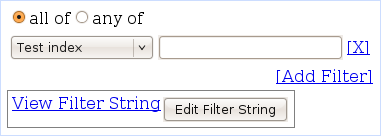

=========================
Setting a Graphing Filter
=========================

These filters manipulate the data displayed and analyzed in your plots
on the graphing interface. The [X] link next to each filter removes the
associated filter from the list (or clears it, if there is only one),
while the [Add Filter] link adds a new filter to the end of the list.

Interface Options
-----------------

-  **all of / any of**: Specify whether you want the data to satisfy all
   or any of the filters you listed.
-  **database column (drop-down)**: Select the database column you are
   going to be filtering on. See
   `Graphing Fields <../frontend/Web/GraphingFilters>` for more
   details.
-  **condition (textbox)**: Specify the condition you want to use for
   the database column you specified. You may enter any condition that
   is valid in a SQL WHERE clause. Examples:

   -  = 12345
   -  LIKE 'kernbench%'
   -  REGEXP 'bad-dimm0[^0-9]\*'

Filter String Viewer
--------------------

In addition to the controls above, there is a viewer area in which you
can see the SQL WHERE clause that the frontend is building. Click View
Filter String to expand the textarea to show the clause. You may also
click "Edit Filter String" to edit the WHERE clause yourself. You may
use any of the fields specified in
`GraphingDatabaseFields <../frontend/Web/GraphingFilters>`.

