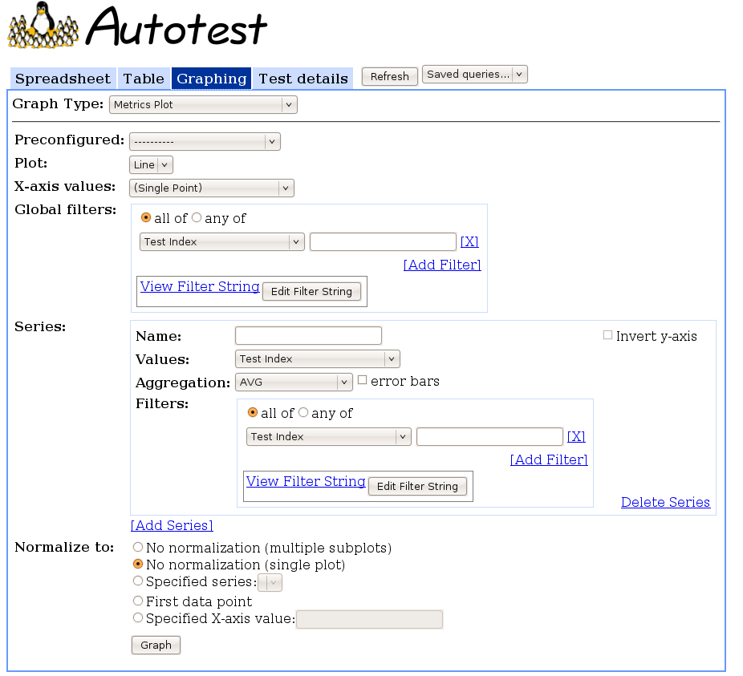

===============================
Using the Metrics Plot Frontend
===============================

The **Metrics plot frontend** is able to generate a line or bar chart of
most TKO database fields against aggregated values of most other TKO
database fields. This is usually used to create plots of performance
data versus some machine property, such as kernel version or BIOS
revision.

Using the Interface
-------------------

Interface Options
~~~~~~~~~~~~~~~~~

-  **Graph Type**: Set to "Metrics Plot" to show this interface.
-  **Preconfigured**: Select a preconfigured graphing query. Use this to
   automatically populate the fields in the interface to a preconfigured
   example. You may then submit the query for plotting as is, or edit
   the fields to modify the query. See
   :doc:`Graphing Pre Configs <../frontend/Web/GraphingPreconfigs>` to more information
   about preconfigured queries.
-  **Plot**: Select whether you want a line plot or a bar chart.
-  **X-axis values**: Select the values to place across the x-axis of
   the plot. For example, selecting "Kernel" create a plot against
   different kernel versions across the x-axis. See
   :doc:`GraphingDatabaseFields <../frontend/Web/GraphingFilters>` for details
   about the different options. In addition to the options listed there,
   **X-axis values** also accepts "(Single Point)" as an input, which
   will plot all values on a single point on the x-axis; this is more
   applicable for bar charts than for line plots.
-  **Global filters**: Set the filters to apply across all series of the
   plot. See `GraphingFilters <GraphingFilters>`_ for more
   information on setting a filter.
-  **Series**: Set each series that you would like to display. Clicking
   the [Add Series] link adds a series to the list. Each series has its
   own Delete Series link, which will remove the series from the list.
   If there is only one series and it is deleted, it will instead be
   reset.

   -  **Name**: The name you want to give the series. It will be
      displayed as the title of its respective subplot if you requested
      multiple subplots, or as a label in the legend otherwise.
   -  **Values**: The values you want to aggregate to plot on the
      y-axis. Typically, this is "Performance Keyval (Value)" to
      aggregate performance data.
   -  **Aggregation**: The type of aggregation you want to do on the
      data returned for each x-axis point. For example, specifying "AVG"
      will plot the average of the value you selected above for each
      point on the x axis.
   -  **error bars**: If the **Aggregation** is "AVG", you may check
      this box to show the standard deviations of each point as error
      bars.
   -  **Filters**: Set the filters you want to apply to this particular
      series. See `GraphingFilters <GraphingFilters>`_ for more
      information on setting a filter.
   -  **Invert y-axis**: Check this box if you want higher numbers
      towards the bottom of the y-axis for this series.

-  **Normalize to**: Set the normalization you want to use on this plot.

   -  **No normalization (multiple subplots)**: Do not normalize the
      data, and display each series on a separate subplot. Note that
      this option is only available for Line plots.
   -  **No normalization (single plot)**: Do not normalize the data, and
      display all series on a single plot. This is the default option.
   -  **Specified series**: Graph all series as percent changes from a
      particular series. That is, for each point on each series, plot
      the percent different of the y-value from the y-value of the
      specified series at their corresponding x-value. The series that
      you normalize against will not be plotted (since all values will
      be 0). If the series you normalize against does not have data for
      some x-values, those values will not be plotted.
   -  **First data point**: Graph all series, renormalized to the first
      valid data point in each series.
   -  **Specified X-axis value**: Graph all series, renormalized to the
      data point at the specified x-axis value for each series. This is
      similar to the above option, but rescales the y-axis for a point
      other than the first data point. You must enter the exact name of
      the x-axis value.

Interacting with the Graph
~~~~~~~~~~~~~~~~~~~~~~~~~~

The four main actions you can do on the graph are:

-  **Hover**: Hovering the cursor over a point or bar shows a tooltip
   displaying the series that the point or bar is from, and the x- and
   y-values for that data.
-  **Click**: Clicking on a point or bar opens a drill-down dialog. The
   dialog shows a sorted list of all the y-values that were aggregated
   to form the point or bar. Clicking on any particular line in that
   list jumps to the **Test detail view** describing the test that
   generated that line of data.
-  **Embed**: Clicking the [Link to this Graph] link at the bottom-right
   of the generated plot displays an HTML snippet you can paste into a
   webpage to embed the graph. The embedded graph updates with live data
   at a specified refresh rate (as the max\_age URL parameter, which is
   in minutes), and show an indication of the last time it was updated.
   Clicking on the embedded graph links to the **Metrics plot
   frontend**, automatically populated with the query that will generate
   the graph. See `AutotestReportingApi <AutotestReportingApi>`_
   for a more powerful way to embed graphs in your pages.
-  **Save**: The graph is delivered as a PNG image, so you can simply
   right-click it and save it if you want a snapshot of the graph at a
   certain point in time.
