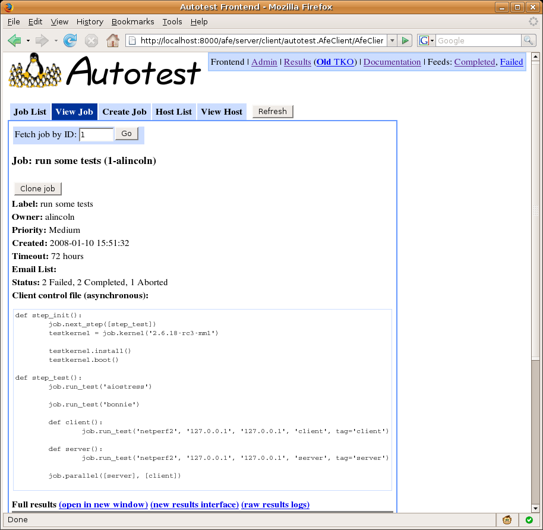
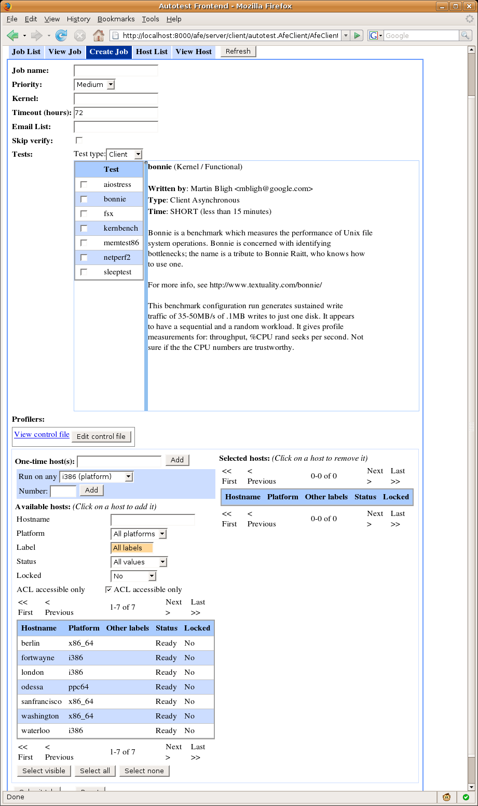
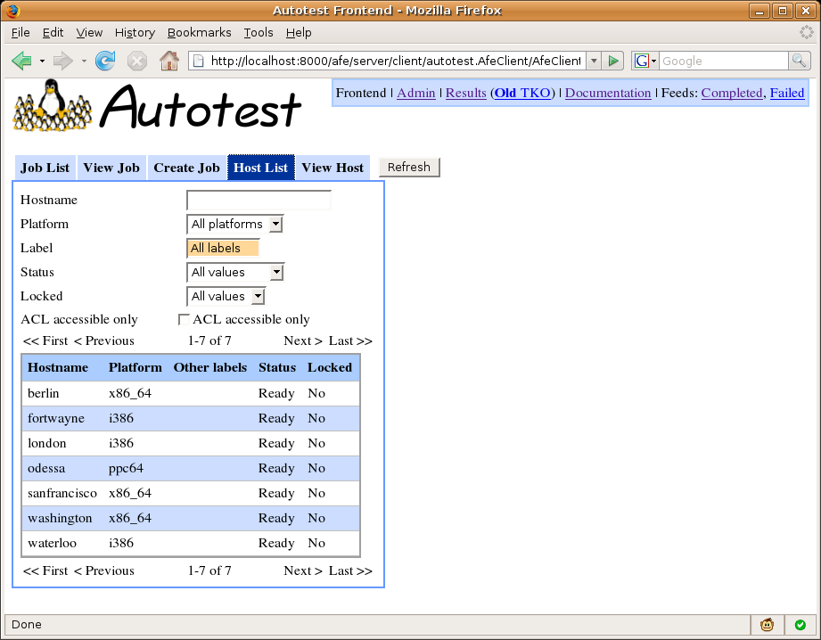
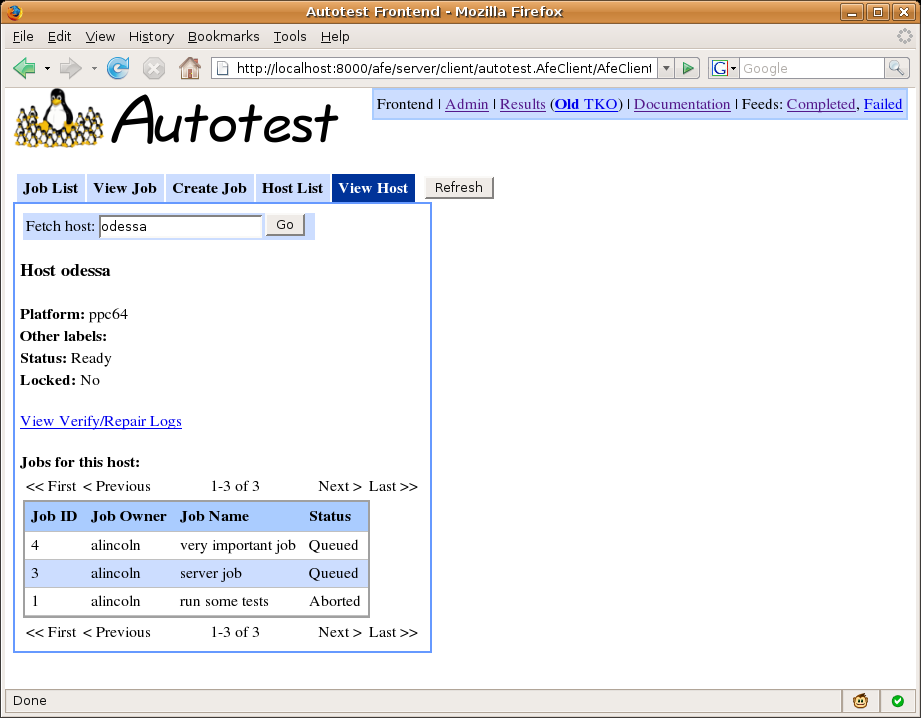
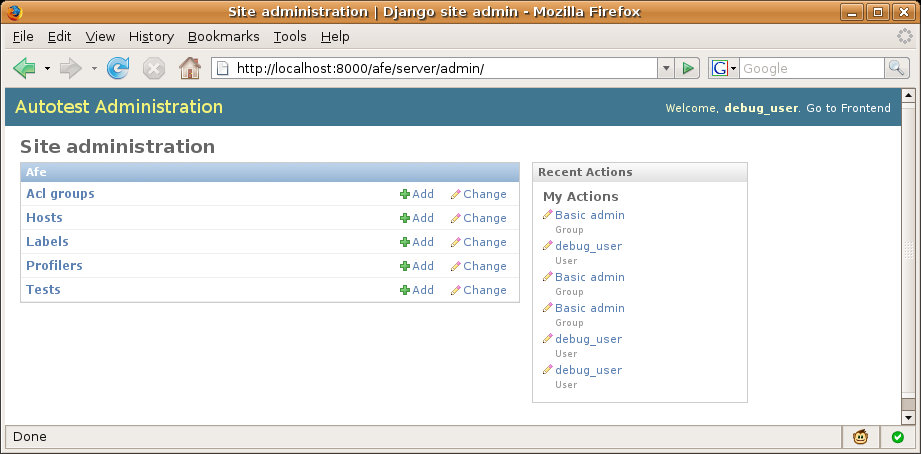
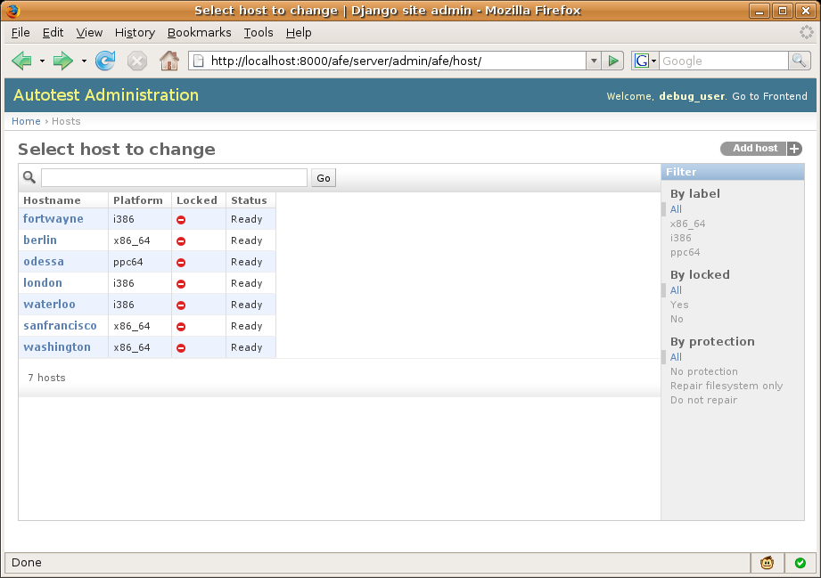
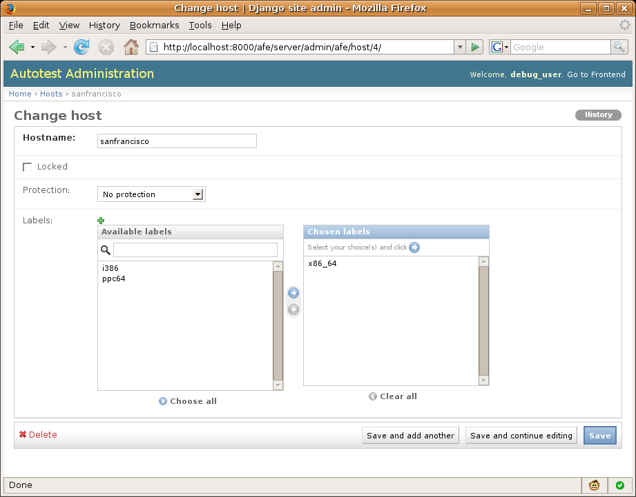

==================
Web Frontend HOWTO
==================

The Autotest web frontend can be used for

-  browsing existing jobs
-  viewing job details and getting to job results and log files
-  submitting new jobs
-  tracking hosts' statuses
-  managing (browsing, creating, modifying, and deleting) hosts, labels,
   profilers, and ACL groups

When you first bring up the frontend, you'll see something like this:

.. figure:: WebFrontendHowTo/joblist.png

Job List
--------

The interface initially shows the Job List tab, which allows you to
browse existing jobs. The four links at the top filter jobs by status -
you can view only queued, running, or finished (which includes completed
and aborted) jobs, or view them all (the default). You can also filter
by job owner and job name. The initial view shows all jobs owned by you.
Most recently submitted jobs are displayed first.

The Hosts column shows how many hosts in each job are currently in each
state (see `JobAndHostStatuses <JobAndHostStatuses>`_). You can use
the Refresh button at the top to refresh the list (it won't refresh
itself). Clicking on a job in the list brings up the View Job tab for
the selected job.

You can select multiple jobs with the checkboxes on the left, or using
the links at the top of the table. You can then using the "Actions" menu
to operate on many jobs at once. Currently, this only allows you to
abort jobs.

View Job
--------

The View Job tab shows details about a single job along with results and
a link to log files.

The box at the top allows you to manually fetch a job by ID. The page
displays basic info about the job, an "Abort Job" button if the job has
not completed, and a "Clone Job" button to create a new job modeled
after the current job. Clone job will present three options:

-  Reuse any similar hosts - if the original job use "run on any" hosts,
   the new job will do the same, so that it could get assigned different
   hosts.
-  Reuse same specific hosts - the exact same set of hosts will be used,
   even if the original job specific "run on any" hosts.
-  Use failed and aborted hosts - uses the hosts have have been aborted,
   or have failed the job in some way

Below this, the full contents of the job's control file are displayed,
follow by job results. This consists of an embedded TKO spreadsheet for
the job with three links above:

-  open in new window - to open the old TKO interface for the job.
-  new results interface - to open the new TKO interface for the job.
-  raw results logs - to bring up a listing of the job results
   directory. This is often useful for debugging when things go wrong.

Finally, the table at the bottom shows all hosts on which the job was
scheduled and the current status of the job on each host (see
`JobAndHostStatuses <JobAndHostStatuses>`_). Links are provided to
jump directly to the status log and debug logs for each host. In
addition, you can select individual hosts and abort them with the
Actions menu. You can clone the job on the selected hosts from the
Actions menu as well. Selecting no hosts and choosing "Clone job on
selected hosts" will clone the job without adding any hosts.

Create Job
----------

This tab allows you to create and submit a new job.

Create job parameters
~~~~~~~~~~~~~~~~~~~~~

-  **Job name** can be any string.
-  **Priority** affects how your job will be placed in the queue; higher
   priority jobs with preempt lower priority ones that have not yet
   started when the jobs are scheduled on the same machine.
-  The **kernel** field allows you to specify a kernel to install on the
   test machine before testing; leaving this field blank will leave out
   the kernel install step. You can specify a URL pointing to a kernel
   source tarball or a .rpm or .deb package. Site-specific extensions
   are also possible.
-  **Timeout** specifies the hours after job creation until the
   scheduler will automatically abort the job if it hasn't yet
   completed.
-  **Max runtime** specifies the hours after the job starts running
   (Autoserv is executed) until the scheduler will automatically abort
   the job if it hasn't yet completed.
-  **Email List** can contain a comma- or space-separated list of email
   addresses which will be notified upon job completion.
-  If **Skip verify** is checked, hosts won't be verified before the job
   is run. This is useful for machine reinstalls among other things.
-  **Reboot before** determines whether hosts will be rebooted before
   the job runs. *If dirty* means the host will be rebooted if it hasn't
   been rebooted since being added, being locked, or having the last job
   run.
-  **Reboot after** determines whether hosts will be rebooted after the
   job runs. *If all tests passed* means the host won't be rebooted if
   any test within the job failed.
-  If **Include failed repair results** is checked, when a machine fails
   repair, "repair" and "verify" test entries will show up in TKO for
   that machine, along with a SERVER\_JOB entry. If unchecked, nothing
   at all will show up in TKO for the failed machine.
-  The **Tests** section contains a table allowing you to select a set
   of client- or server-side tests to run. You can click on any test to
   view its description. Your test selections, along with the kernel
   field, are used to build the job's control file.
-  **Profilers** shows available profilers than can be enabled for your
   job.
-  Clicking **View control file** will display a box that shows the
   control file being constructed from your choices. You may edit the
   control file by hand by clicking **Edit control file**. This will
   make the control file field editable, but disables the kernel input
   and all test selector. If you want to go back and change your
   selections in these inputs, you'll need to revert your kernel
   changes. When editing a control file, you have two additional
   options. You shouldn't have to edit these unless you know what you're
   doing.

   -  **Client or Server** - whether the control file should run on the
      client-side or the server-side.
   -  **Synchronous** - if checked, the job will wait for all machines
      to be ready and then run all machines in a single autoserv
      instance. This is usually only necessary for multi-machine tests.

-  The **Available hosts** and **Selected hosts** tables allow you to
   select hosts on which to run the job. Individual hosts can be
   selected and deselected by clicking on them. The filters at the top
   of the Available hosts table can be used to narrow your selection,
   just like in the Hosts tab. "Select visible" adds all hosts currently
   visible in the Available hosts table. "Select all" adds all hosts
   currently matching the filters.

   -  The **Run on any** box allows you to request that the job be run
      on any machines from a given platform or label. The machines will
      be automatically selected from the set of available machines when
      the job is run.
   -  The **One-time host(s)** box allows you to enter a hostname (or
      space-separated list of hostnames) that will be added to the
      database just for the job, without leaving the machine available
      for other jobs.

-  Finally, the **Submit Job** button will attempt to submit your job,
   and any errors will show up in red.

Host List
---------

This tab allows you to browse all hosts in the system.

The table can be searched and filtered using the boxes at the top.
Clicking on a host brings you to the "View Host" tab for that host.

Additionally, you can force hosts to go into Verify by selecting them
and choosing "Reverify hosts" from the Actions menu.

View Host
---------

This tab shows detailed information for a particular host including a
list of all jobs queued, running and previously run on that host. It
additionally provides a link to the scheduler's verify/repair logs for
the host.

User preferences
----------------

The user preferences tab allows you to set defaults for creating jobs.
See
`WebFrontendHowTo#Createjobparameters <WebFrontendHowTo#Createjobparameters>`_.

-  **Reboot before** and **Reboot after** control default values for the
   corresponding options on the Create Job page.
-  **Show experimental tests** will make the Create Job page show tests
   that are marked as "experimental" in the control file.

Admin interface
---------------

Clicking the "Admin" link in the upper right corner takes you to the
admin interface for managing hosts, labels, profilers and ACL groups.
Tests may be managed through the admin interface as well, but the
preferred server setup is to use ``utils/test_importer.py`` to
automatically populate the DB with information from the test control
files themselves (see `ControlRequirements <ControlRequirements>`_
and ``utils/test_importer.py --help``).

This is the built-in Django admin system. Here you can browse, create,
modify, and delete objects. The link in the upper right corner takes you
back to the frontend. The different objects types appear on the Admin
index page. Clicking on any object type takes you to a list of that
object type.

The list can be sorted, searched, and filtered. The link at the top
right allows you to create a new object, and clicking on any object
takes you to the edit page for that object.

From this page you can fill in the information in the fields and click
"Save" at the lower right corner to add or edit the object. You can also
delete the object using the link at the lower left corner.

For help on the meanings of different fields, see the database documentation.
