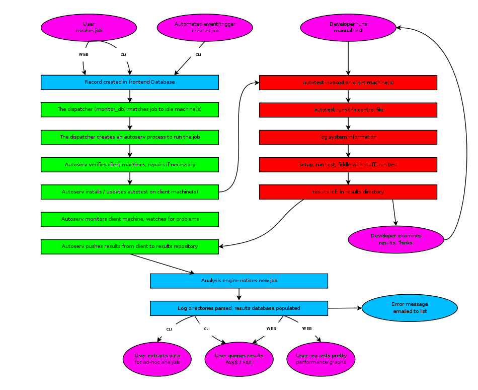

===========================
Autotest structure overview
===========================

This document intends to be a high level overview of the autotest
project structure. We try to be brief and show the high level diagrams.

Simplified block diagram
------------------------

For the sake of clarity, some things are simplified here, but it gives
you a good idea of the overall layout.

.. figure:: AutotestStructure/block_structure.png

Web interface and command line interface
----------------------------------------

The web interface and the command line interface are complementary ways
to interact with autotest and create jobs. Both were designed to have
the same functionality, to add to the user's convenience. The interfaces
allows you to:

-  Manage jobs? - create, monitor, abort, etc.
-  Manage client hosts
-  Look at results.

The frontends will inject jobs into the server by creating records in a
mysql database.

Server
------

The server consists of three main parts:

-  A mysql database that holds information on all jobs, clients (test
   machines), users and tests.
-  The dispatcher (monitor\_db) - chooses the jobs from the database to
   run. It's input is the database, pretty much all it does is start
   autoserv processes to service requests.

   -  There is normally one dispatcher process per machine
   -  Client side jobs are run asyncronously (as client machines become
      available)
   -  Server side jobs are run syncronously (ie we wait for all clients
      before commencing)

-  Autoserv: the server manages clients via autoserv processes - there
   will be one autoserv process per running job?. Each autoserv process:

   -  controls and monitors one or more clients
   -  verifies clients are working properly, and if it fails
      verification, attempts to repair it
   -  manages the execution of a job?
   -  updates the autotest software on each client before commencing
      work.

The mysql database can live on a different machine than the dispatcher.
There can be multiple dispatchers to spread the workload, though each
can service a few thousand clients, so this is not normally necessary.

Client
------

The client does most of the work of running a job?; this can be invoked:

-  manually - from ``client/autotest-local <control_file_name>``
-  via the server

A typical job workflow is as follows:

Results repository
------------------

A directory tree of all the results. Each job has a well formatted
:doc:`directory structure <../developer/ResultsSpecification>`

Results MySQL DB
----------------

A simple mysql database containing the jobs, test results, and
performance metrics for each test

Overall structure
-----------------

With all the parts of the code briefly commented, it's easier to
understand the overall structure diagram:

.. figure:: AutotestStructure/overall_structure.png
