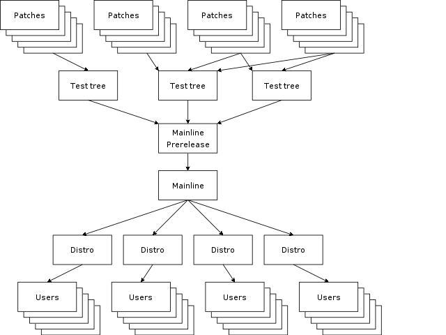
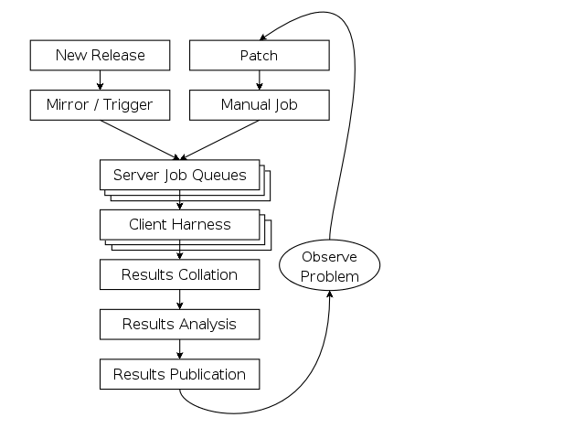
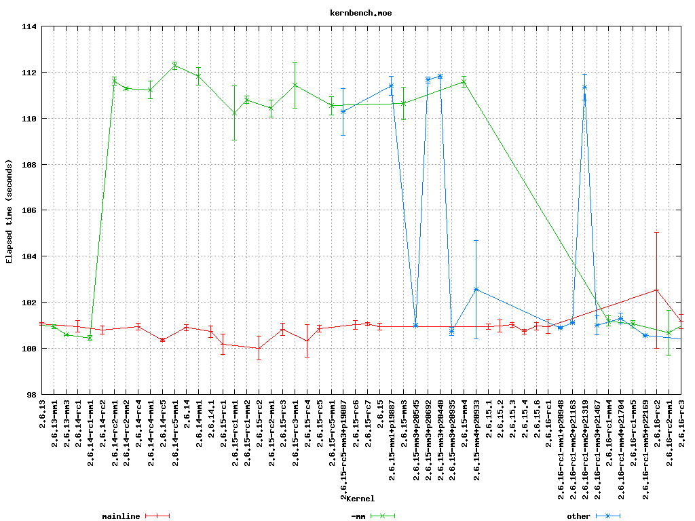

====================
Autotest White Paper
====================

Abstract
--------

This paper describes the motivation for, and design goals of, the
autotest and test.kernel.org projects. Autotest is a framework for fully
automated testing, that is designed primarily to test the Linux kernel,
though is useful for many other functions too. Test.kernel.org is a
framework for communicating, sharing, and analysing test results.

In a traditional corporate systems software development environment,
there is normally a large test team responsible for assuring the quality
of the final product. Open source projects do not have that luxury, and
we need to find another way to run testing. We feel that the only
realistic way to achieve the goal is to fully automate the test process,
and drastically reduce the need for human staffing. It turns out that
this also solves several other critical problems with testing.

-  Consistency - it's much easier to guarantee the tests are run the
   same way as last time.
-  Knowledge capture - the knowledge of how to run testing is not held
   in one person, but within a system.
-  Sharing - you can easily share tests with vendors, partners, and
   across a wide community.
-  Reproducibility - they say 90% of fixing a bug is to get an easily
   reproducible test case.

Testing is not about running tests ... testing is about finding and
fixing bugs. We have to:

-  Run the tests
-  Find a bug
-  Classify the bug
-  Hand the bugs off to a developer
-  Developer investigates bug (cyclical)
-  Developer tests some proposed fix (cyclical)
-  Fix checked in
-  New release issued to test team.

So many test systems I see are oriented only around the first two (or
even one!) steps. This is massively inefficient - so often I see
developers writing a simple testcase to reproduce what happens in a more
complex test, or proprietary application, and then these are thrown
away. If we started with open tests that we could freely and easily
share, much effort and time would be saved. This is not just about the
cost of the people's time, salaries and machine resources. It's about
the opportunity cost of stalling a release, which is massively greater -
these problems are often single-threading the critical path.

We want bug identification, investigation, and fixing to be done earlier
in the cycle. This allows multiple debugging efforts to be done in
parallel, without affecting others, as well as many other advantages,
such as the problem still being fresh in the developers mind, and not
interacting with other later changes. This means running tests on
multiple codebases (development trees), with high frequency - how can we
scale to this? Fully automated testing. Machines are cheap, people are
expensive - this is the reality of the modern age. For Linux, the
problem is compounded by the staggering diversity of hardware and kernel
configurations that we support.

Moreover, a test system is not just about simple functional tests; we
should also identify performance regressions and trends, adding
statistical analysis. A broad spectrum of tests are necessary -- boot
testing, regression, function, performance, and stress testing; from
disk intensive to compute intensive to network intensive loads. A fully
automated test harness also empowers other techniques that are
impractical when testing manually, in order to make debugging and
problem identification easier, e.g. automated binary chop search amongst
thousands of patches to weed out dysfunctional changes.

It's critical that when operating in an open community, we can share and
compare test results - that necessitates consistency of results formats.
The easiest way to achieve this is to share one common test harness.

Introduction
------------

It is critical for any project to maintain a high level of software
quality, and consistent interfaces to other software that it uses or
uses it. There are several methods for increasing quality, but none of
these works in isolation, we need a combination of:

-  skilled developers carefully developing high quality code,
-  static code analysis,
-  regular and rigorous code review,
-  functional tests for new features,
-  regression testing,
-  performance testing, and
-  stress testing.

Whilst testing will never catch all bugs, it will improve the overall
quality of the finished product. Improved code quality results in a
better experience not only for users, but also for developers, allowing
them to focus on their own code. Even simple compile errors hinder
developers.

In this paper we will look at the problem of automated testing, the
current state of it, and our views for its future. Then we will take a
case study of the test.kernel.org automated test system. We will examine
a key test component, the client harness, in more detail, and describe
the Autotest test harness project. Finally we will conclude with our
vision of the future and a summary.

Automated Testing
-----------------

It is obvious that testing is critical, what is perhaps not so obvious
is the utility of regular testing at all stages of development. There
are two main things we're trying to achieve here, parallelism of work,
and catching the bugs as quickly as possible. These are critical as:

-  it prevents replication of the bad code into other code bases,
-  fewer users are exposed to the bug,
-  the code is still fresh in the authors mind,
-  the change is less likely to interact with subsequent changes, and
-  the code is easy to remove should that be required.

In a perfect world all contributions would be widely tested before being
applied; however, as most developers do not have access to a large range
of hardware this is impractical. More reasonably we want to ensure that
any code change is tested before being introduced into the mainline
tree, and fixed or removed before most people will ever see it. In the
case of Linux, Andrew Morton's -mm tree (the de facto development tree)
and other subsystem specific trees are good testing grounds for this
purpose.

Test early, test often!

The open source development model and Linux in particular introduces
some particular challenges. Open-source projects generally suffer from
the lack of a mandate to test submissions and the fact that there is no
easy funding model for regular testing. Linux is particularly hard hit
as it has a constantly high rate of change, compounded with the
staggering diversity of the hardware on which it runs. It is completely
infeasible to do this kind of testing without extensive automation.

There is hope; machine-power is significantly cheaper than man-power in
the general case. Given a large quantity of testers with diverse
hardware it should be possible to cover a useful subset of the possible
combinations. Linux as a project has plenty of people and hardware; what
is needed is a framework to coordinate this effort.

The Testing Problem
-------------------

As we can see from the diagram above Linux's development model forms an
hourglass starting highly distributed, with contributions being
concentrated in maintainer trees before merging into the development
releases (the -mm tree) and then into mainline itself. It is vital to
catch problems here in the neck of the hourglass, before they spread out
to the distros -- even once a contribution hits mainline it is has not
yet reached the general user population, most of whom are running distro
kernels which often lag mainline by many months.

In the Linux development model, each actual change is usually small and
attribution for each change is known making it easy to track the author
once a problem is identified. It is clear that the earlier in the
process we can identify there is a problem, the less the impact the
change will have, and the more targeted we can be in reporting and
fixing the problem.

Whilst contributing untested code is discouraged we cannot expect lone
developers to be able to do much more than basic functional testing,
they are unlikely to have access to a wide range of systems. As a
result, there is an opportunity for others to run a variety of tests on
incoming changes before they are widely distributed. Where problems are
identified and flagged, the community has been effective at getting the
change rejected or corrected.

By making it easier to test code, we can encourage developers to run the
tests before ever submitting the patch; currently such early testing is
often not extensive or rigorous, where it is performed at all. Much
developer effort is being wasted on bugs that are found later in the
cycle when it is significantly less efficient to fix them.

The State of the Union
----------------------

It is clear that a significant amount of testing resource is being
applied by a variety of parties, however most of the current testing
effort goes on after the code has forked from mainline. The distribution
vendors test the code that they integrate into their releases, hardware
vendors are testing alpha or beta releases of those distros with their
hardware. Independent Software Vendors (ISVs) are often even later in
the cycle, first testing beta or even after distro release. Whilst
integration testing is always valuable, this is far too late to be doing
primary testing, and makes it extremely difficult and inefficient to fix
problems that are found. Moreover, neither the tests that are run, nor
the results of this testing are easily shared and communicated to the
wider community.

There is currently a large delay between a mainline kernel releasing and
that kernel being accepted and released by the distros, embedded product
companies and other derivatives of Linux. If we can improve the code
quality of the mainline tree by putting more effort into testing
mainline earlier, it seems reasonable to assume that those \`customers'
of Linux would update from the mainline tree more often. This will
result in less time being wasted porting changes backwards and forwards
between releases, and a more efficient and tightly integrated Linux
community.

What Should we be Doing?
------------------------

Linux's constant evolutionary approach to software development fits well
with a wide-ranging, high-frequency regression testing regime. The
\`release early, release often' development philosophy provides us with
a constant stream of test candidates; for example the -git snapshots
which are produced twice daily, and Andrew Morton's collecting of the
specialized maintainer trees into a bleeding-edge -mm development tree.

In an ideal world we would be regression testing at least daily
snapshots of all development trees, the -mm tree and mainline on all
possible combinations of hardware; feeding the results back to the
owners of the trees and the authors of the changes. This would enable
problems to be identified as early as possible in the concentration
process and get the offending change updated or rejected. The
test.kernel.org testing project provides a preview of what is possible,
providing some limited testing of the mainline and development trees,
and is discussed more fully later.

Just running the tests is not sufficient, all this does is produce large
swaths of data for humans to wade through; we need to analyse the
results to engender meaning, and isolate any problems identified.

Regression tests are relatively easy to analyse, they generate a clean
pass or fail; however, even these can fail intermittently. Performance
tests are harder to analyse, a result of 10 has no particular meaning
without a baseline to compare it against. Moreover, performance tests
are not 100% consistent, so taking a single sample is not sufficient, we
need to capture a number of runs and do simple statistical analysis on
the results in order to determine if any differences are statistically
significant or not. It is also critically important to try to
distinguish failures of the machine or harness from failures of the code
under test.

Case Study: test.kernel.org
---------------------------

We have tried to take the first steps towards the automated testing
goals we have outlined above with the testing system that generates the
test.kernel.org website. Whilst it is still far from what we would like
to achieve, it is a good example of what can be produced utilising time
on an existing in house system sharing and testing harness and a shared
results repository.

New kernel releases are picked up automatically within a few minutes of
release, and a predefined set of tests are run across them by a
proprietary IBM® system called ABAT, which includes a client harness
called autobench. The results of these tests are then collated, and
pushed to the TKO server, where they are analysed and the results
published on the TKO website.

Whilst all of the test code is not currently open, the results of the
testing are, which provides a valuable service to the community,
indicating (at least at a gross level) a feel for the viability of that
release across a range of existing machines, and the identification of
some specific problems. Feedback is in the order of hours from release
to results publication.

How it Works
------------

The TKO system is architected as show in the figure above. Its is made
up of a number of distinct parts, each described below:

The mirror / trigger engine: test execution is keyed from kernel
releases; by any -mm tree release (2.6.16-rc1-mm1), git release
(2.6.17-rc1-git10), release candidate (2.6.17-rc1), stable release
(2.6.16) or stable patch release (2.6.16.1). A simple rsync local mirror
is leveraged to obtain these images as soon as they are available. At
the completion of the mirroring process any newly downloaded image is
identified and those which represent new kernels trigger testing of that
image.

Server Job Queues: for each new kernel, a predefined set of test jobs
are created in the server job queues. These are interspersed with other
user jobs, and are run when time is available on the test machines.
IBM's ABAT server software currently fulfils this function, but a simple
queueing system could serve for the needs of this project.

Client Harness: when the test system is available, the control file for
that test is passed to the client harness. This is responsible for
setting up the machine with appropriate kernel version, running the
tests, and pushing the results to a local repository. Currently this
function is served by autobench. It is here that our efforts are
currently focused with the Autotest client replacement project which we
will discuss in detail later.

Results Collation: results from relevant jobs are gathered
asynchronously as the tests complete and they are pushed out to
test.kernel.org. A reasonably sized subset of the result data is pushed,
mostly this involves stripping the kernel binaries and system
information dumps.

Results Analysis: once uploaded the results analysis engine runs over
all existing jobs and extracts the relevant status; this is then
summarised on a per release basis to produce both overall red, amber and
green status for each release/machine combination. Performance data is
also analysed, in order to produce historical performance graphs for a
selection of benchmarks.

Results Publication: results are made available automatically on the TKO
web site. However, this is currently a \`polled' model; no automatic
action is taken in the face of either test failures or if performance
regressions are detected, it relies on developers to monitor the site.
These failures should be actively pushed back to the community via an
appropriate publication mechanism (such as email, with links back to
more detailed data).

Observed problems: When a problem (functional or performance) is
observed by a developer monitoring the analysed and published results,
this is manually communicated back to the development community
(normally via email). This often results in additional patches to test,
which can be manually injected into the job queues via a simple script,
but currently only by an IBM engineer. These then automatically flow
through with the regular releases, right through to publication on the
matrix and performance graphs allowing comparison with those releases.

TKO in Action
-------------

The regular compile and boot testing frequently shakes out bugs as the
patch that carried them enters the -mm tree. By testing multiple
architectures, physical configurations, and kernel configurations we
often catch untested combinations and are able to report them to the
patch author. Most often these are compile failures, or boot failures,
but several performance regressions have also been identified.

As a direct example, recently the performance of highly parallel
workloads dropped off significantly on some types of systems,
specifically with the -mm tree. This was clearly indicated by a drop off
in the kernbench performance figures. In the graph above we can see the
sudden increase in elapsed time to a new plateau with 2.6.14-rc2-mm1.
Note the vertical error bars for each data point -- doing multiple test
runs inside the same job allows us to calculate error margins, and
clearly display them.

Once the problem was identified some further analysis narrowed the bug
to a small number of scheduler patches which were then also tested;
these appear as the blue line (\`other' releases) in the graph. Once the
regression was identified the patch owner was then contacted, several
iterations of updated fixes were then produced and tested before a
corrected patch was applied. This can be seen in the figures for
2.6.16-rc1-mm4.

The key thing to note here is that the regression never made it to the
mainline kernel let alone into a released distro kernel; user exposure
was prevented. Early testing ensured that the developer was still
available and retained context on the change.

Summary
-------

The current system is providing regular and useful testing feedback on
new releases and providing ongoing trend analysis against historical
releases. It is providing the results of this testing in a public
framework available to all developers with a reasonable turn round time
from release. It is also helping developers by testing on rarer hardware
combinations to which they have no access and cannot test.

However, the system is not without its problems. The underlying tests
are run on a in-house testing framework (ABAT) which is currently not in
the public domain; this prevents easy transport of these tests to other
testers. As a result there is only one contributor to the result set at
this time, IBM. Whilst the whole stack needs to be made open, we explain
in the next section why we have chosen to start first with the client
test harness.

The tests themselves are very limited, covering a subset of the kernel.
They are run on a small number of machines, each with a few, fixed
configurations. There are more tests which should be run but lack of
developer input and lack of hardware resources on which to test prevent
significant expansion.

The results analysis also does not communicate data back as effectively
as it could to the community -- problems (especially performance
regressions) are not as clearly isolated as they could be, and
notification is not as prompt and clear as it could be. More data
\`folding' needs to be done as we analyse across a multi-dimensional
space of kernel version, kernel configuration, machine type, toolchain,
and tests.

Client Harnesses
----------------

As we have seen, any system which will provide the required level of
testing needs to form a highly distributed system, and be able to run
across a large test system base. This will necessitate a highly flexible
client test harness; a key component of such a system. We have used our
experiences with the IBM autobench client, and the TKO analysis system
to define requirements for such a client. This section will discuss
client harnesses in general and lead on to a discussion of the Autotest
project's new test harness.

We chose to attack the problem of the client harness first as it seems
to be the most pressing issue. With this solved, we can share not only
results, but the tests themselves more easily, and empower a wide range
of individuals and corporations to run tests easily, and share the
results. By defining a consistent results format, we can enable
automated collation and analysis of huge amounts of data.

Requirements / Design Goals
---------------------------

A viable client harness must be operable stand-alone or under an
external scheduler infrastructure. Corporations already have significant
resources invested in bespoke testing harnesses which they are not going
to be willing to waste; the client needs to be able to plug into those,
and timeshare resources with them. On the other hand, some testers and
developers will have a single machine and want something simple they can
install and use. This bimodal flexibility is particularly relevant where
we want to be able to pass a failing test back to a patch author, and
have them reproduce the problem.

The client harness must be modular, with a clean internal infrastructure
with simple, well defined APIs. It is critical that there is clear
separation between tests, and between tests and the core, such that
adding a new test cannot break existing tests.

The client must be simple to use for newcomers, and yet provide a
powerful syntax for complex testing if necessary. Tests across multiple
machines, rebooting, loops, and parallelism all need to be supported.

We want distributed scalable maintainership, the core being maintained
by a core team and the tests by the contributors. It must be able to
reuse the effort that has gone into developing existing tests, by
providing a simple way to encapsulate them. Whilst open tests are
obviously superior, we also need to allow the running of proprietary
tests which cannot be contributed to the central repository.

There must be a low knowledge barrier to entry for development, in order
to encourage a wide variety of new developers to start contributing. In
particular, we desire it to be easy to write new tests and profilers,
abstracting the complexity into the core as much as possible.

We require a high level of maintainability. We want a consistent
language throughout, one which is powerful and yet easy to understand
when returning to the code later, not only by the author, but also by
other developers.

The client must be robust, and produce consistent results. Error
handling is critical -- tests that do not produce reliable results are
useless. Developers will never add sufficient error checking into
scripts, we must have a system which fails on any error unless you take
affirmative action. Where possible it should isolate hardware or harness
failures from failures of the code under test; if something goes wrong
in initialisation or during a test we need to know and reject that test
result.

Finally, we want a consistent results architecture -- it is no use to
run thousands of tests if we cannot understand or parse the results. On
such a scale such analysis must be fully automatable. Any results
structure needs to be consistent across tests and across machines, even
if the tests are being run by a wide diversity of testers.

What Tests are Needed?
----------------------

As we mentioned previously, the current published automated testing is
very limited in its scope. We need very broad testing coverage if we are
going to catch a high proportion of problems before they reach the user
population, and need those tests to be freely sharable to maximise test
coverage.

Most of the current testing is performed in order to verify that the
machine and OS stack is fit for a particular workload. The real workload
is often difficult to set up, may require proprietary software, and is
overly complex and does not give sufficiently consistent reproducible
results, so use is made of a simplified simulation of that workload
encapsulated within a test. This has the advantage of allowing these
simulated workloads to be shared. We need tests in all of the areas
below:

Build tests simply check that the kernel will build. Given the massive
diversity of different architectures to build for, different
configuration options to build for, and different toolchains to build
with, this is an extensive problem. We need to check for warnings, as
well as errors.

Static verification tests run static analysis across the code with tools
like sparse, lint, and the Stanford checker, in the hope of finding bugs
in the code without having to actually execute it.

Inbuilt debugging options (e.g. CONFIG\_DEBUG\_PAGEALLOC,
CONFIG\_DEBUG\_SLAB) and fault insertion routines (e.g. fail every 100th
memory allocation, fake a disk error occasionally) offer the opportunity
to allow the kernel to test itself. These need to be a separated set of
test runs from the normal functional and performance tests, though they
may reuse the same tests.

Functional or unit tests are designed to exercise one specific piece of
functionality. They are used to test that piece in isolation to ensure
it meets some specification for its expected operation. Examples of this
kind of test include LTP and Crashme.

Performance tests verify the relative performance of a particular
workload on a specific system. They are used to produce comparisons
between tests to either identify performance changes, or confirm none is
present. Examples of these include: CPU performance with Kernbench and
AIM7/reaim; disk performance with bonnie, tbench and iobench; and
network performance with netperf.

Stress tests are used to identify system behaviour when pushed to the
very limits of its capabilities. For example a kernel compile executed
completely in parallel creates a compile process for each file. Examples
of this kind of test include kernbench (configured appropriately), and
deliberately running under heavy memory pressure such as running with a
small physical memory.

Profiling and debugging is another key area. If we can identify a
performance regression, or some types of functional regression, it is
important for us to be able to gather data about what the system was
doing at the time in order to diagnose it. Profilers range from
statistical tools like readprofile and lockmeter to monitoring tools
like vmstat and sar. Debug tools might range from dumping out small
pieces of information to full blown crashdumps.

Existing Client Harnesses
-------------------------

There are a number of pre-existing test harnesses in use by testers in
the community. Each has its features and problems, we touch on a few of
them below.

IBM autobench is a fairly fully featured client harness, it is
completely written in a combination of shell and perl. It has support
for tests containing kernel builds and system boots. However, error
handling is very complex and must be explicitly added in all cases, but
does encapsulate the success or failure state of the test. The use of
multiple different languages may have been very efficient for the
original author, but greatly increases the maintenance overheads. Whilst
it does support running multiple tests in parallel, loops within the job
control file are not supported nor is any complex \`programming'.

OSDL STP The Open Systems Development Lab (OSDL) has the Scalable Test
Platform (STP). This is a fully integrated testing environment with both
a server harness and client wrapper. The client wrapper here is very
simple consisting of a number of shell support functions. Support for
reboot is minimal and kernel installation is not part of the client.
There is no inbuilt handling of the meaning of results. Error checking
is down to the test writer; as this is shell it needs to be explicit
else no checking is performed. It can operate in isolation and results
are emailable, reboot is currently being added.

LTP (`http://ltp.sourceforge.net/ <http://ltp.sourceforge.net/>`_) The
Linux Test Project is a functional / regression test suite. It contains
approximately 2900 small regression tests which are applied to the
system running LTP. There is no support for building kernels or booting
them, performance testing or profiling. Whilst it contains a lot of
useful tests, it is not a general heavy weight testing client.

A number of other testing environments currently exist, most appear to
suffer from the same basic issues, they evolved from the simplest
possible interface (a script) into a test suite; they were not designed
to meet the level of requirements we have identified and specified.

All of those we have reviewed seem to have a number of key failings.
Firstly, most lack most lack bottom up error handling. Where support
exists it must be handled explicitly, testers never will think of
everything. Secondly, most lack consistent machine parsable results.
There is often no consistent way to tell if a test passes, let alone get
any details from it. Lastly, due to their evolved nature they are not
easy to understand nor to maintain. Fortunately it should be reasonably
easy to wrap tests such as LTP, or to port tests from STP and autobench.

Autotest - a Powerful Open Client
---------------------------------

The Autotest open client is an attempt to address the issues we have
identified. The aim is to produce a client which is open source,
implicitly handles errors, produces consistent results, is easily
installable, simple to maintain and runs either standalone or within any
server harness.

Autotest is an all new client harness implementation. It is completely
written in Python; chosen for a number of reasons, it has a simple,
clean and consistent syntax, it is object oriented from inception, and
it has very powerful error and exception handling. Whist no language is
perfect, it meets the key design goals well, and it is open source and
widely supported.

As we have already indicated, there are a number of existing client
harnesses; some are even open-source and therefore a possible basis for
a new client. Starting from scratch is a bold step, but we believe that
the benefits from a designed approach outweigh the effort required
initially to get to a workable position. Moreover, much of the existing
collection of tests can easily be imported or wrapped.

Another key goal is the portability of the tests and the results; we
want to be able to run tests anywhere and to contribute those test
results back. The use of a common programming language, one with a
strict syntax and semantics should make the harness and its contained
tests very portable. Good design of the harness and results
specifications should help to maintain portable results.

The autotest Test Harness
-------------------------

Autotest utilises an executable control file to represent and drives the
users job. This control file is an executable fragment of Python and may
contain any valid Python constructs, allowing the simple representation
of loops and conditionals. Surrounding this control file is the Autotest
harness, which is a set of support functions and classes to simplify
execution of tests and allow control over the job.

The key component is the job object which represents the executing job,
provides access to the test environment, and provides the framework to
the job. It is responsible for the creation of the results directory,
for ensuring the job output is recorded, and for any interactions with
any server harness. Below is a trivial example of a control file:

::

        job.runtest('test1', 'kernbench', 2, 5)

One key benefit of the use of a real programming language is the ability
to use the full range of its control structures in the example below we
use an iterator:

::

        for i in range(0, 5):
            job.runtest('test%d' % i, 'kernbench',
                    2, 5)

Obviously as we are interested in testing Linux, support for building,
installing and booting kernels is key. When using this feature, we need
a little added complexity to cope with the interruption to control flow
caused by the system reboot. This is handled using a phase stepper which
maintains flow across execution interruptions, below is an example of
such a job, combining booting with iteration:

::

        def step_init():
            step_test(1)

        def step_test(iteration):
            if (iteration < 5):
                job.next_step([step_test,
                              iteration + 1])

            print "boot: %d" % iteration

            kernel = job.distro_kernel()
            kernel.boot()

Tests are represented by the test object; each test added to Autotest
will be a subclass of this. This allows all tests to share behaviour,
such as creating a consistent location and layout for the results, and
recording the result of the test in a computer readable form. Below is
the class definition for the kernbench benchmark. As we can see it is a
subclass of test, and as such benefits from its management of the
results directory hierarchy.

::

        import test
        from autotest_utils import *

        class kernbench(test):

            def setup(self,
                      iterations = 1,
                      threads = 2 * count_cpus(),
                      kernelver = '/usr/local/src/linux-2.6.14.tar.bz2',
                      config =  os.environ['AUTODIRBIN'] + "/tests/kernbench/config"):

                print "kernbench -j %d -i %d -c %s -k %s" % (threads, iterations, config, kernelver)

                self.iterations = iterations
                self.threads = threads
                self.kernelver = kernelver
                self.config = config

                top_dir = job.tmpdir+'/kernbench'
                kernel = job.kernel(top_dir, kernelver)
                kernel.config([config])

            def execute(self):
                testkernel.build_timed(threads)         # warmup run
                for i in range(1, iterations+1):
                    testkernel.build_timed(threads, '../log/time.%d' % i)

                os.chdir(top_dir + '/log')
                system("grep elapsed time.* > time")

Summary
-------

We feel that Autotest is much more powerful and robust design than the
other client harnesses available, and will produce more consistent
results. Adding tests and profilers is simple, with a low barrier to
entry, and they are easy to understand and maintain.

Much of the power and flexibility of Autotest stems from the decision to
have a user-defined control file, and for that file to be written in a
powerful scripting language. Whilst this was more difficult to
implement, the interface the user sees is still simple. If the user
wishes to repeat tests, run tests in parallel for stress, or even write
a bisection search for a problem inside the control file, that is easy
to do.

The Autotest client can be used either as standalone, or easily linked
into any scheduling backend, from a simple queueing system to a huge
corporate scheduling and allocation engine. This allows us to leverage
the resources of larger players, and yet easily allow individual
developers to reproduce and debug problems that were found in the lab of
a large corporation.

Each test is a self-contained modular package. Users are strongly
encouraged to create open-source tests (or wrap existing tests) and
contribute those to the main test repository on test.kernel.org (see the
Autotest wiki for details). However, private tests and repositories are
also allowed, for maximum flexibility. The modularity of the tests means
that different maintainers can own and maintain each test, separate from
the core harness. We feel this is critical to the flexibility and
scalability of the project.

We currently plan to support the Autotest client across the range of
architectures and across the main distros. There is no plans to support
other operating systems, as it would add unnecessary complexity to the
project. The Autotest project is released under the GNU Public License.

Future
------

We need a broader spectrum of tests added to the Autotest project.
Whilst the initial goal is to replace autobench for the published data
on test.kernel.org, this is only a first step -- there are a much wider
range of tests that could and should be run. There is a wide body of
tests already available that could be wrapped and corralled under the
Autotest client.

We need to encourage multiple different entities to contribute and share
testing data for maximum effect. This has been stalled waiting on the
Autotest project, which is now nearing release, so that we can have a
consistent data format to share and analyse. There will be problems to
tackle with quality and consistency of data that comes from a wide range
of sources.

Better analysis of the test results is needed. Whilst the simple
red/yellow/green grid on test.kernel.org and simple gnuplot graphs are
surprisingly effective for so little effort, much more could be done. As
we run more tests, it will become increasingly important to summarise
and fold the data in different ways in order to make it digestible and
useful.

Testing cannot be an island unto itself -- not only must we identify
problems, we must communicate those problems effectively and efficiently
back to the development community, provide them with more information
upon request, and be able to help test attempted fixes. We must also
track issues identified to closure.

There is great potential to automate beyond just identifying a problem.
An intelligent automation system should be able to further narrow down
the problem to an individual patch (by bisection search, for example,
which is O(log2) number of patches). It could drill down into a problem
by running more detailed sets of performance tests, or repeating a
failed test several times to see if a failure was intermittent or
consistent. Tests could be selected automatically based on the area of
code the patch touches, correlated with known code coverage data for
particular tests.

Summary
-------

We are both kernel developers, who started the both test.kernel.org and
Autotest projects out of a frustration with the current tools available
for testing, and for fully automated testing in particular. We are now
seeing a wider range of individuals and corporations showing interest in
both the test.kernel.org and Autotest projects, and have high hopes for
their future.

In short we need:

-  more automated testing, run at frequent intervals,
-  those results need to be published consistently and cohesively,
-  to analyse the results carefully,
-  better tests, and to share them, and
-  a powerful, open source, test harness that is easy to add tests to.

There are several important areas where interested people can help
contribute to the project:

-  run a diversity of tests across a broad range of hardware,
-  contribute those results back to test.kernel.org,
-  write new tests and profilers, contribute those back, and
-  for the kernel developers ... fix the bugs!!!

An intelligent system can not only improve code quality, but also free
developers to do more creative work.

Acknowledgements
----------------

We would like to thank OSU for the donation of the server and disk space
which supports the test.kernel.org site.

We would like to thank Mel Gorman for his input to and review of drafts
of this paper.
