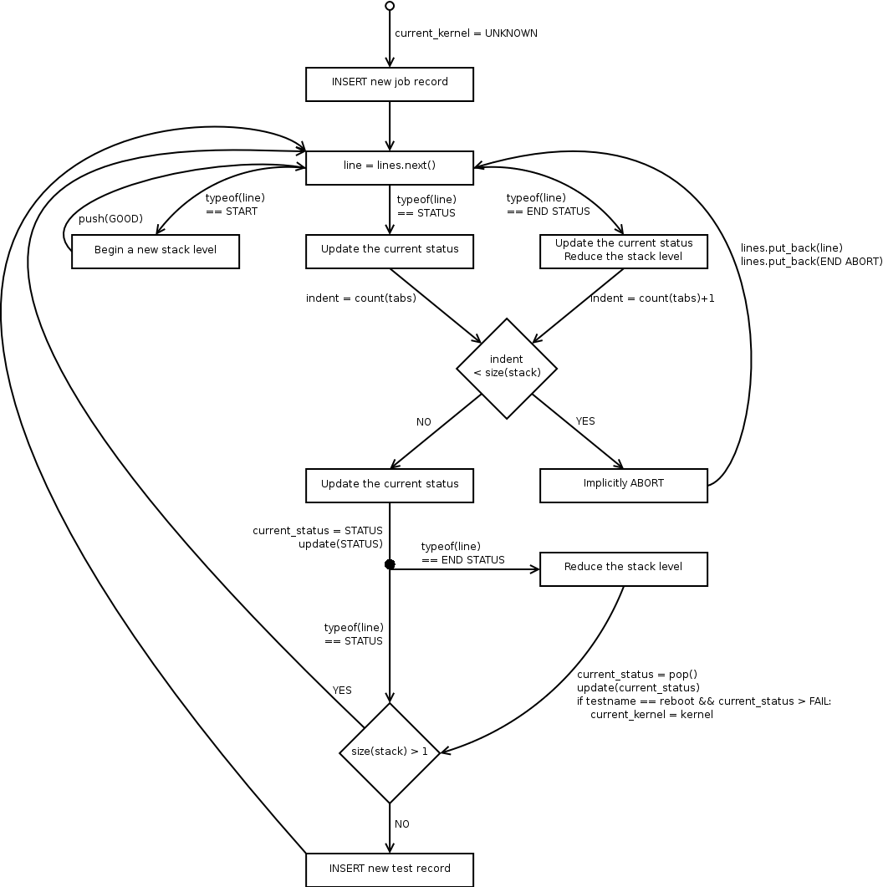

================
General Overview
================

The purpose of the parser is to take one or more directories of test
results and convert them into summary test results in the TKO database
to be available for more generic queries. The parser is primarily only
concerned with the status log for a test, since this is where the
summary of job and test passes (or failures) is stored, however it also
makes use of other result data (e.g. keyval entries) to help annotate
the test results with relevant information such as the kernel version
used for each test.

The parser is usable as a standalone script so that it can be run by
hand on complete results, however it is also importable and usable as an
in-process python library to allow for continuous parsing of partial
results without having to continually launch new processes and perform a
full re-parse every time new data is generated.

Versioning
----------

We need to always be able to parse existing log data, while at the same
time providing for the capability in the future to change the logging
format to provide new capabilities and data. These types of changes will
generally require parser changes, and although in the ideal case we
could extend the parser in such a way that it can still parse both new
and old data, this may not always be possible (or may significantly
increase the difficulty of making the required changes). The
implementation of this specification is an example of this.

The version of the status log format should be written out by autoserv
(or whatever application is being used to generate job results) into the
job keyval files as the variable status\_version. If the keyval is
unspecified then this implies version 0, the pre-specification version
of the parser, while the parser specified by this document is version 1.
Once the version is determined the results data should then be fed into
the appropriate parser library and pushed into the database.

In the long term, it may also be desirable to specify some from of
intermediate output that the parsers will produce to help isolate them
from changes in the backing database; the current approach of writing
out data manually will still make it difficult to change the schema as
every parser version would have to be changed, not just the "current"
version. However, at this time the only two versions in existence will
be writing data out to the same schema so putting in the development
time to build an intermediate output format would provide no immediate
benefits.

Work Required to Implement this Specification
---------------------------------------------

This specification represents a description of how the parser ideally
SHOULD work, rather than a description of how it currently does work.
However, this specification can be implemented incrementally, requiring
the following work:

#. Change Autotest to properly write out full kernel information during
   the reboot.verify. The current code does output a kernel version, but
   this does not handle cases where you are building kernels with custom
   patches.
#. Change Autotest to write the status\_version entry out to the results
   keyval files.
#. Build a parser class that uses the library approach described in this
   specification (a stateful parser object, separate out the reading of
   files from the parser itself, allow it to be used in standalone and
   in-process manner) but based on the existing parsing algorithm rather
   than the new one proposed by this specification.
#. Change autoserv to perform continuous parsing using the library
   version of the parser.
#. Implement a new parser class that uses the algorithm described in
   this specification.
#. Change the parser to auto-select either the new parser or the legacy
   parser based on the value of status\_version (0=legacy, 1=new) in the
   results.

Once these steps are complete, a next possible step might be to move the
actual parsing of data (or at least the writing of parser data into the
database) back *out* of autoserv and into a separate process; however,
this separate process would be a single daemon shared between all
instances of autoserv on a machine, instead of the current model where a
parser process is launched every time the results are parsed. This would
avoid the current problem where a large number of database connections
are consumed by the parsing tasks.

Library Design
--------------

The base of the parser will be a stateful object designed for parsing
the results of a single job (i.e. a single-machine job, or one machine
of a multi-machine asynchronous job). It will in no way be responsible
for accessing the results directory; this will be the job of the calling
code. This should make it easier to embed the parser into autoserv
itself. It should also isolate the parser from the details of how
watching for new data is being performed.

Given the results directory of a completed test, the parser can find all
of the information it needs in the following places:

-  status.log - the actual status logs come from here, this is the core
   of what the parser needs
-  keyval - most of the job data comes from here, specifically:

   -  username - the user who ran the job
   -  label - the label of the job
   -  machine - the hostname that this specific job was run on
   -  job\_queued, job\_started, job\_finished - timestamps from when
      the job was queued, started and finished
   -  owner - the owner of the test machine

-  <subdir>/keyval - some additional test meta-data comes from here,
   namely:

   -  version - the version number of the test

-  <subdir>/results/keyval - optional test data regarding iterations
   comes from here

When being used as a standalone process the parser will need to be able
to access this data and so provides functions for retrieving it. It also
provides a main() function that allows you to run the parser:

-  on a single machine results directory (i.e. a single-machine job, or
   a single machine of a multi-machine job)
-  on a multi-machine results directory
-  on a top-level results directory, parsing all the results of an
   entire results repository

Parser Algorithm
----------------

The general algorithm of the parser is most easily summarized by the
following diagram:

For tracking the "current" status, the parser has to use a stack of
statuses. Manipulations of this stack are included in some of the
transitions in the diagram, with the following operations:

-  push(status) pushes status onto the stack
-  pop() pops the top status off of the stack
-  update(status) replaces the top of the stack with status if and only
   if status is "worse" than whatever is already on top

The update operation uses the concept of some statuses being "worse"
than others. The idea behind this is that if a bunch of tests are being
run as part of a single, cohesive group (or a single test produces
multiple status lines of output) then the results should be combined in
such a way that negative results poison the results of the entire set.
So if some results in the group are GOOD and some are FAIL, then the
entire group should be considered a FAIL. The expected set of statuses
is, from "best" to "worst":

-  GOOD - the operation was successful
-  WARN - something suspicious has happened, but not a clear failure
-  FAIL - the test has failed
-  ABORT - something catastrophic has happened, and the entire job is
   terminating

Conceptually, the parser operates on a stream of lines. In a standalone
parser process where it just performs a full re-parse and then exits the
parser will simply operate on the results of file.readlines in a single
shot. However, it should be just as easily usable in an in-process,
continuous parsing fashion where it is fed status lines as they are
generated and maintains its state until the application (e.g. autoserv)
indicates that the job is finished and there are no more results.

Database Handling
-----------------

There already exists code in tko/db.py for performing database lookups,
inserts and deletes on the relevant objects as well as for looking up
the appropriate authentication information in the Autotest
configuration, so the parser will simply make use of this. The insertion
of parsed results will **not** be performed in a transactional fashion
in order to facilitate continuous parsing. The expected data flow is
simply:

#. Delete any existing results job & test data.
#. Insert job entry.
#. Insert test entries as tests complete in the status log.

If a transaction mechanism needs to be implemented on top of this then
that should be straightforward to do manually.
