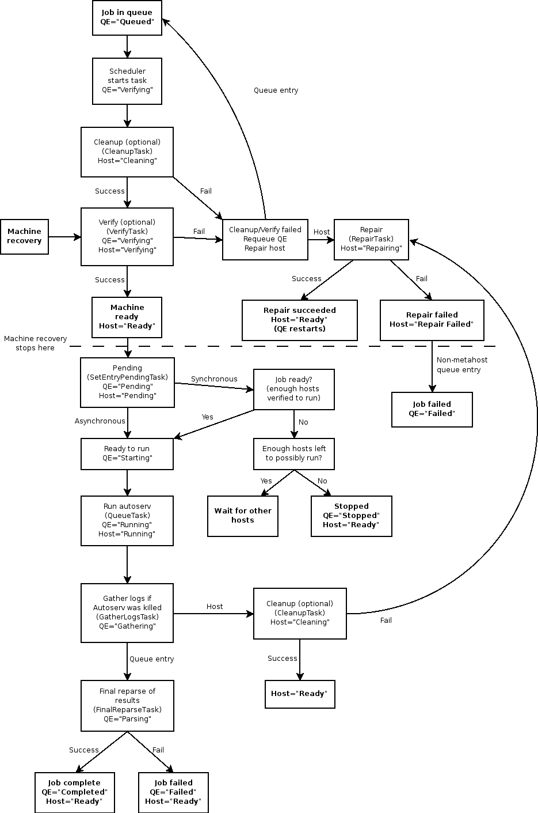

=======================
Scheduler specification
=======================

Basic flow
----------

Results files
-------------

-  The scheduler always creates a "job directory", results/<job tag>
-  For asynchronous jobs, the scheduler creates a results/<job
   tag>/<hostname> directory for each host and runs one instance of
   autoserv for each host with these per-host directories as results
   directories.
-  For synchronous jobs, the scheduler creates a results/<job
   tag>/groupN directory for each group of hosts formed, as defined by
   the job's sync\_count. N is a numeric index starting at zero. The
   scheduler runs an instance of autoserv for each group of machines
   with these per-group directories as results directories.

Metahosts always get queue.log.<id> files created in the job directory
(results/<job tag>). These logs contain a single line for each time a
metahost is assigned a new host or cleared of its host. Each line
includes a timestamp.

Verify/repair/cleanup information is handled like so:

-  During execution of verify/repair/cleanup, Autoserv output is
   directed to a temporary file under the results/drone\_tmp directory.
-  When Autoserv completes, this file is copied to the host logs
   directory under results/hosts/<hostname>.
-  If the task fails and causes job failure, the log is also copied to
   the execution results directory (results/<job tag>/<hostname or
   groupN>). This happens if:

   -  The task was a pre-job cleanup or verify
   -  The task failed
   -  The correspond queue entry was scheduled for a particular host,
      not a metahost (for metahosts, the queue entry would simply choose
      a new host, so it wouldn't make sense to include the verify
      failure as part of the job).

   If the subsequent repair succeeds, the log file is removed and the
   job is restarted.

The scheduler only creates a .machines file for asynchronous
multi-machine jobs. It creates this file on the fly by appending each
hostname to this file immediately before running the main autoserv
process on that host. For synchronous jobs, autoserv creates the
.machines file itself.

Distributed implementation
--------------------------

In order to support distributed setups (see
`DistributedServerSetup <DistributedServerSetup>`_), the scheduler
performs much of its work through the drone\_manager module. A "drone"
is a machine on which Autoserv is executed, which is not necessarily the
machine on which the server is running. Here is a guide to this
implementation:

-  Overview

   -  All OS-dependent calls in the scheduler have been extracted into
      an interface on the drone\_manager.DroneManager? class. This
      includes filesystem access and process execution, killing and
      monitoring.
   -  DroneManager? methods queue up actions to perform on drones.
   -  The scheduler calls DroneManager?.refresh() at the beginning of
      each tick, which connects to each drone and gathers information on
      running processes.
   -  The scheduler calls DroneManager?.execute\_actions() at the end of
      each tick, which connects to each drone and executes all queued
      actions.

-  DroneUtility?

   -  The drone\_utility.DroneUtility? class contains implementations of
      all the OS-dependent actions.
   -  The drone\_utility.MethodCall? class abstracts a call to a method
      on DroneUtility?.
   -  DroneUtility?.execute\_calls() accepts a list of MethodCall?
      objects and returns a list of results, along with any warnings
      that were generated.
   -  The drone\_utility module is executable as a script. It accepts a
      filename on the command line and reads a list of MethodCall?
      objects from that file in pickled format. This implements a simple
      batched RPC mechanism for DroneUtility?.

-  Drone objects

   -  The drones module provides implementations of the
      drones.\_AbstractDrone interface. AbstractDrone? allows the client
      to queue up method calls to a DroneUtility? instance and execute
      them on the drone machine. There are two implementations:

      -  a \_LocalDrone class which simply imports drone\_utility and
         calls methods directly, and
      -  a \_RemoteDrone class which executes drone\_utility on a remote
         host using the server.hosts.ssh\_host.SSHHost class. It pickles
         the call list into a file, sends the file to the remote host,
         and executes drone\_utility remotely on that file.

   -  The drones.get\_drone(hostname) factory method is used to retrieve
      a drone object.

-  DroneManager?

   -  DroneManager? maintains a list of drone objects, one for each
      drone as well as one for the results repository host. Methods on
      DroneManager? are implemented by queuing up method calls on the
      appropriate drone objects. DroneManager?.execute\_actions() then
      executes all queued calls for each drone in turn.
   -  DroneManager? also contains limited handling for dead drones.

See Also
--------

-  `SchedulerAutoservInteractions <SchedulerAutoservInteractions>`_
